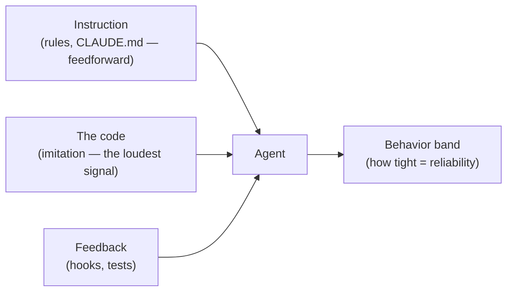

# How to Grow from Junior to Senior in the Age of AI — Full-Day Workshop

The agent changes what it means to be junior more than what it means to be senior. A senior
already has the judgment the tool can't supply. A junior is building that judgment at the exact
moment the tool offers to skip it — it hands you working code faster than you can understand it,
and the whole pull is to accept the diff and move on. This workshop is the structured refusal to
skip, stretched across a full day on a codebase big enough to have real design decisions.

- **Who it's for:** early-career engineers working with an AI coding tool, and the leads who mentor them.
- **What you leave with:** the comprehension card, a hexagonal refactor you did by hand, one of each
  charter mechanism (rule, hook, command, skill, agent) that you built and ran, and a daily habit.
- **The spine:** the agent produces plausible code fast; seniority is the judgment to tell plausible
  from correct — and, at this scale, to tell *code that matches its charter* from *code that has drifted*.
  That judgment is trained, not downloaded.

> Work straight through **[The Lab](#the-lab)** — that's the six-hour session. **Lunch does not count
> toward the six hours.** The session ends with **[open Q&A](#open-qa-and-wrap)**.
> **[After the workshop](#after-the-workshop--the-take-home-lab)** is your take-home reps;
> **[Instructor notes](#instructor-notes)** are at the very bottom.

---

## Ports and adapters in 60 seconds (out of scope — but it's our example)

We are **not here to teach ports and adapters.** It's just the design our example app uses, and you
only need a plain-language picture of it to follow along. Here it is.

Imagine a coffee shop's checkout. The **core job** is: add up the prices, add tax, take the payment,
print a receipt. That core shouldn't care *how* payment happens — cash drawer, card reader, phone tap.
It just needs "something that can take a payment."

- A **port** is the *shape of a helper the core needs*, described as a promise: "give me something that
  can look up a price," "…that can settle a total," "…that can print a receipt." The core talks to the
  promise, not to any particular gadget.
- An **adapter** is a *real gadget that keeps the promise*: the actual cash drawer, the actual card
  reader. You can swap one for another and the core never notices.
- The **one wiring spot** (`main.py`) is where you decide, today, which real gadgets to plug in.

The rule that makes it "ports and adapters": **the core depends only on the promises (ports), never on
a specific gadget (adapter).** That's it. If you remember one sentence: *the core names what it needs;
the edges provide it; they meet in one wiring spot.* When our example code breaks that rule, that's the
drift we're hunting — you don't need to be a hexagonal-architecture expert to see a rule being broken.

---

## The full day at a glance

Six hours of active time, split by lunch (which doesn't count). Breaks included. Q&A closes the day.

| Clock | Min | Segment |
|---|---|---|
| 0:00 | 25 | Welcome, the frame, and the comprehension card |
| 0:25 | 20 | Ports and adapters in 60 seconds; read the app |
| 0:45 | 35 | **Module 1** — Comprehension: read the drift |
| 1:20 | 10 | Break |
| 1:30 | 30 | **Module 2** — Watch the drift compound (the agent imitates the code) |
| 2:00 | 25 | **Module 3** — Rules at depth (feedforward; the specificity knob) |
| — | — | **Lunch — does not count toward the six hours** |
| 2:25 | 40 | **Module 4** — The refactor: fix the code to match the rule (hands-on) |
| 3:05 | 30 | **Module 5** — Hooks at depth (feedback; the position knob) |
| 3:35 | 10 | Break |
| 3:45 | 30 | **Module 6** — Commands (build-it lab) |
| 4:15 | 30 | **Module 7** — Skills (build-it lab) |
| 4:45 | 30 | **Module 8** — Agents (build-it lab) |
| 5:15 | 15 | **Module 9** — Context and continuity: the charter file, memory, planning |
| 5:30 | 15 | **Module 10** — The bigger picture: surfaces and mechanisms |
| 5:45 | 15 | **Module 11** — Mindset, strategies, pairing with a senior |
| 6:00 | — | **Open Q&A** to the end of the session |

Tight on time? Safe cuts, in order: Module 10 → the second half of Module 3 → shrink the talk. Never
cut Modules 1, 2, and 4 — the read, the compound, and the fix are the arc.

---

# The Lab

## Before you start — get to green

You can read code and you've used an AI coding tool once. That's enough. **Prerequisites:**

- **Python 3.11+**, available on your PATH as `python3` (the workshop uses `python3` throughout).
- **A coding agent — [Claude Code](https://claude.com/claude-code) recommended.** The seed's rules, hooks,
  commands, skills, and agents are wired for Claude Code and work out of the box; another capable agentic
  tool can follow along, but you'll adapt the mechanics yourself.

**Python by platform.** The workshop writes every command as `python3`. Get 3.11+ and know what `python3`
maps to on your machine:

| OS | Get Python 3.11+ | What `python3` means here |
|---|---|---|
| **macOS** | `brew install python`, or the [python.org](https://www.python.org/downloads/) installer. (System Python may be absent — install your own.) | `python3` — as written. |
| **Linux** | Usually preinstalled; otherwise `sudo apt install python3 python3-pip` (Debian/Ubuntu) or your distro's equivalent. | `python3` — as written. |
| **Windows** | [python.org](https://www.python.org/downloads/) installer — check **"Add python.exe to PATH"**. | Native Windows has no `python3`: use **`python`** (or **`py -3`**). In **WSL** or **Git Bash**, `python3` works as written. |

The seed's hooks call `python3` too (in `.claude/settings.json`); on native Windows, change those two
commands to `python` — or just run the lab in WSL/Git Bash, where nothing needs changing.

Run this first and confirm a green suite — don't debug your environment on lab time:

```bash
git clone https://github.com/tacoda/workshop-junior-to-senior-full-day.git
cd workshop-junior-to-senior-full-day/seed
python3 --version                 # 3.11 or newer
pip install pytest && pytest      # 5 passed — you're ready
python3 main.py                    # prints two receipts
```

Have your coding agent installed and working on the `seed/` folder *before* the session — Modules 2, 4, 6,
7, and 8 all use it live. Anyone red at the start pairs with someone green.

## Your tool: the comprehension card

The whole method on one page. Use it in the lab and keep it next to your keyboard after.

```text
THE DAILY RULE
  Don't merge a change you can't explain — to the agent, out loud, in your own words.
  Green pipeline = permission to proceed. Red = a lesson before a human had to teach it.
  And: green means the tests that exist passed — not that the design is right.

FIVE QUESTIONS (comprehension in — ask these of any diff or file)
  1. What does this do, in one sentence?
  2. Where does the change enter the system, and where does it leave?
  3. Why is it written this way? (If neither a rule nor a doc answers, you found a charter gap.)
  4. Is it consistent with the rest of the codebase AND the charter? Which nearby code disagrees?
  5. Which part would I call slop if an agent wrote it — plausible, passing, quietly wrong or drifted?

FIVE MOVES (comprehension out — the junior→senior cases)
  1. Characterize before you change — pin current behavior in a test before you touch it.
  2. Rename in anger — fix the worst-named thing everywhere; watch it clarify.
  3. Make it boring — rewrite the clever version as the one you'd rather debug at 3 a.m.
  4. Predict the failure — write how you expect it to fail, then run it. Were you right?
  5. Catch the agent being wrong — find the confident, fluent, wrong (or drifted) answer. Prove it.
```

## Module 1 · Comprehension — read the drift

Everything is in `seed/`. First, read the **charter**, then the **code**, and notice they disagree.

```bash
pytest                       # 5 passed
python3 main.py               # cash $11.70, card $11.73
```

Open `seed/CLAUDE.md`. It states a clear architecture rule: **ports and adapters** — the core depends
only on ports, adapters hold the mechanics, concretes are wired only in `main.py`.

Now open `seed/checkout.py`. It does the opposite. One `CheckoutService.checkout` method looks up prices
from a dict baked into the core, computes tax, branches on cash-vs-card inline, and formats and prints
the receipt — all in one place. No ports. No adapters. The charter says one thing; the code does another.

Run the five questions on `checkout.py`, out loud, with a partner. The one that bites is **question 4**:
*is it consistent with the charter?* It is not — and the tests are green anyway, because they only check
that the totals come out right (**behavior**), never how the code is arranged (**design**).

> **Green means "the tests that exist passed," not "the code matches the charter."** A behavior suite
> cannot see design drift. That's the same lesson as "green ≠ correct," one level up.

A filled card naming the drift is your first deliverable — and everyone reaches it.

## Module 2 · Watch the drift compound

Here is why the drift matters. First, look at what drift *looks like* — apply the version an agent handed
us when asked to add a member discount "using ports and adapters" against this tangled code:

```bash
git apply patches/agent-adds-discount.diff
pytest                       # still green — the inline discount passes the suite
python3 main.py               # works; a member list and a rate bolted into checkout.py, no port
git apply -R patches/agent-adds-discount.diff
```

The suite never noticed the design got worse. That is the point: **more inline logic, still green.** This
patch is the reliable artifact — run it every time.

Now run it live to feel the variance. Open `seed/` in your AI tool and ask it, verbatim:

> Add a member discount: members get 10% off. Follow the charter — use ports and adapters.

**Two things can happen, and both teach the lesson.** On a repo this small, with the charter right in front
of it, a capable agent often *complies* — it defines a `DiscountPolicy` port and an adapter, ignoring the
tangle. Good. But it may just as easily copy the surrounding shape and inline the discount into `checkout.py`
(the patch above is exactly that). Which one you get is not reliable — and that unreliability is itself the
finding.

> **The drift is a scale effect.** Here the rule is one short file and the counterexample is one small class,
> so a strong model can still hear the rule over the code. In a real codebase — the rule buried in a long
> charter, round-the-wrong-way patterns repeated across dozens of call sites — *the code becomes the loudest
> instruction*, and the agent copies it past a rule it barely weighs. The lab is too small to force this every
> time; the patch shows you what it produces, and the takeaway is what it points at: **a rule the code
> contradicts is a rule the agent will eventually contradict too.** You cannot fix that with a better rule
> alone — you have to fix the *code*, so the example the agent imitates is the right one, and gate it so it
> stays that way.

## Module 3 · Rules at depth — feedforward and the specificity knob

A **rule** is *feedforward*: guidance that shapes the code *before* it's written. Its design choice is
**specificity**. The seed ships the architecture rule in two strengths so you can feel the tradeoff.

| Rule (`seed/.claude/rules/`) | What it says | Tradeoff |
|---|---|---|
| `architecture-vague.md` | "Keep the architecture clean; separate concerns." | Cheap, universal, ages well — and exerts almost no force. A tangled class reads as "separated concerns." |
| `architecture-concrete.md` | "Domain imports `checkout.ports` and never `checkout.adapters`; new concerns enter through a port; concretes wired only in `main.py`; discounts are a `DiscountPolicy` port, not an inline member list." | More work, narrower — but it names the boundary precisely enough that a violation is unambiguous, to a human *and* to a hook. |

Swap the vague rule into `CLAUDE.md`, restart the agent, and re-run Module 2's prompt: watch the vague
rule fail to steer. **A rule you cannot fail is a rule that cannot steer.** Reach for feedforward on
*contested decisions the model won't guess right* — here, where the seams go — not on things it already does.

But notice the ceiling. Even the *concrete* rule only holds while the codebase is small enough for the agent
to hear it over the code (Module 2) — and at scale the code wins. Feedforward is necessary and not
sufficient. Which is why the next move is to fix the code — and then gate it, so the guarantee doesn't depend
on which way the agent leaned today.

## Module 4 · The refactor — make the code match the rule *(the payoff)*

This is the senior move and the heart of the day. You will turn the drifted `checkout.py` into the ports-
and-adapters shape the charter always asked for. The answer key lives in `seed/reference/` — glance at it
when stuck, but do the moves yourself first.

Refactor in small, verifiable steps, running `pytest` after each so behavior never changes:

1. **Extract the domain values.** Move `Money` reasoning and receipt data into small domain types
   (`checkout/money.py`, `checkout/model.py`). Run the tests.
2. **Name the ports.** Create `checkout/ports.py` with three Protocols: `PricingProvider` (look up a
   price), `PaymentMethod` (settle a total), `ReceiptSink` (emit a receipt). This is "the core names what
   it needs."
3. **Push mechanics to adapters.** Move the catalog dict into `InMemoryCatalog`, the cash/card branch into
   `CashPayment`/`CardPayment`, the printing into `ConsoleReceiptSink` — each in `checkout/adapters/`.
4. **Rewrite the service against ports.** `CheckoutService` now takes its ports by injection and orchestrates
   them; it imports `checkout.ports` and nothing from `checkout.adapters`.
5. **Wire it in `main.py`.** The composition root constructs the concrete adapters and passes them in.

**Two decisions the recipe forces — expect them, they're part of the lab.** The shipped tests were written
against the tangled code, so making the code hexagonal breaks them, and *that's the senior work*:

- **The tests must move to the composition root too.** `tests/test_checkout.py` calls `CheckoutService()`
  with no arguments — which stops compiling the moment the service takes its ports by injection (step 4).
  Don't add default concrete adapters to `__init__` to keep the old call working: that forces `service.py`
  to import `checkout.adapters` and trips the hook. Instead, build the service through a helper in `main.py`
  and have the test call that — a behavior-preserving change. `reference/tests/` shows the pattern.
- **Moving `Money` into the package breaks `from money import Money`.** `tests/test_money.py` and the old
  `main.py` import top-level `money`. When `Money` moves to `checkout/money.py`, update those imports (or
  leave a one-line re-export shim at `money.py`). Either is fine — but the recipe won't decide it for you.

Run `pytest` — still green, same behavior, completely different design. Then compare against
`reference/` (`cd reference && pytest` → 9 passed). **The difference is the deliverable:** the drift you
read in Module 1 is gone, and the example the agent will imitate next is now the correct one.

> Re-run Module 2's prompt against your refactored code. With the surrounding code now hexagonal, the agent
> is far likelier to add the discount as a `DiscountPolicy` port — the pattern it now sees. The code stopped
> voting for the tangle. **That vote was the deciding one all along** — which is why fixing the code, not
> just the rule, is the senior move.

## Module 5 · Hooks at depth — feedback and the position knob

A rule is a nudge; you just watched a good one lose. A **hook** is *feedback*: a deterministic check that
runs and can **refuse** a bad result. It's a guarantee, not a suggestion — and a hook can guard a *design*
invariant, not just a value.

The seed ships the architecture check at two positions. Same check ("does a domain file import an
adapter?"), different distance from the mistake — the **position knob**.

| Hook (`seed/.claude/hooks/`) | Event | Speed / consequence |
|---|---|---|
| `architecture-gate-edit.py` | `PostToolUse` on `Edit`/`Write` | **Fast.** Fires the instant a domain file is saved with an adapter import; agent corrected mid-task, fix is local. |
| `architecture-gate-commit.py` | `PreToolUse` on `git commit` | **Late.** Fires only at ship time; nothing broken lands, but the coupling may be buried under later work, so untangling costs more. |

These were **dormant** all morning — while the code was the single `checkout.py` file there was no
`checkout/` package for them to check. Now that you've refactored, they're live. Try it: add
`from .adapters.payment import CashPayment` to `checkout/service.py` and save.

```text
architecture-gate (edit): checkout/service.py imports a concrete adapter — the domain must depend
ONLY on ports (checkout/ports.py), never on checkout.adapters.
```

The bad edit can't survive. **Three things now agree — the rule (feedforward), the code (imitation), and
the hook (feedback)** — the full combination a rule or a hook alone could only gesture at.

Reach for feedback on *invariants that must never be violated*, whichever way the agent leans. Reach for
feedforward on *contested choices the model won't guess right*. A rule without a hook is a suggestion; a
hook without a rule is a gate no one explained. The design decision you fixed today deserves both.

## Module 6 · Commands — a reusable invocation you trigger *(build-it lab)*

A **command** is a saved prompt you invoke by name — the thing you keep typing, written down once. It's
feedforward you fire on demand, not a rule that's always on. The seed ships two in `seed/.claude/commands/`:

- `/comprehend <file>` — runs the five questions on a target and returns answers, changing nothing.
- `/check-ports <file>` — audits a file against the architecture rule and reports violations.

**Try one:** in your AI tool, run `/check-ports checkout.py` (before you refactored) or on a `reference/`
file (after). It reports the same drift you found by hand — now on demand, in seconds.

**Build one (the lab).** A command is just a markdown file: the filename is the command name, and the body
is the prompt, with `$ARGUMENTS` for what you pass. Create `seed/.claude/commands/prove-drift.md`:

```markdown
---
description: Given a file and the charter, write a failing check that proves the drift
argument-hint: [file]
---
Read $ARGUMENTS and the charter (CLAUDE.md). If the code contradicts the architecture rule,
write the smallest test or grep that FAILS on the current code and would PASS once it complies.
Show me the check and the command to run it. Do not fix the code.
```

Run `/prove-drift checkout.py`. You just turned "catch the agent wrong" into a one-word tool.

| When to reach for a command | When *not* to |
|---|---|
| A prompt you type more than twice; a team-standard workflow; onboarding a repeatable check. | A one-off ask; something a rule should enforce always (make it a rule); anything needing enforcement (make it a hook). |

## Module 7 · Skills — guidance that loads when it's relevant *(build-it lab)*

A **skill** is like a rule, with one difference that matters at scale: **it loads only when the model
decides it's relevant**, instead of sitting in context all the time. That's *progressive disclosure* —
you keep the always-on charter small and let deep guidance appear exactly when the task calls for it.

The seed ships `seed/.claude/skills/ports-and-adapters/`: a `SKILL.md` with the four-step recipe for
adding a capability behind a port, **plus a bundled checker it runs** — `check_architecture.py`, which
scans the domain and fails if anything imports a concrete adapter. That's what makes it a skill and not
just a rule: it carries its own tool. The frontmatter `description` is the trigger — the model reads it
and pulls in the body (and the checker) when you're doing design work ("add a feature", "refactor").

Run the skill's checker yourself:

```bash
python3 .claude/skills/ports-and-adapters/check_architecture.py reference/checkout   # PASS
python3 .claude/skills/ports-and-adapters/check_architecture.py checkout             # after your refactor
```

**Feel the difference.** The always-on architecture rule in `CLAUDE.md` costs context on *every* turn,
even when you're fixing a typo. The skill costs nothing until you touch the design — then it's there with
the full recipe. Same guidance, paid for only when used.

**Build one (the lab).** Build a second architecture skill — narrower than the shipped one, and
guidance-only (not every skill needs a bundled script; this shows the range). Create
`seed/.claude/skills/adapter-purity/SKILL.md`:

```markdown
---
name: adapter-purity
description: Use when editing anything in checkout/adapters/ — loads the rule that adapters hold mechanics only, never business decisions.
---
# Adapters hold mechanics, not decisions
An adapter implements a port. It does I/O and mechanics — it must NOT decide policy.
- Who counts as a member, what the tax rate is, how big a discount is -> the DOMAIN decides.
- Reading a price, charging a card, printing a receipt -> the ADAPTER does.
Before finishing an adapter, check that no branch here encodes a business rule:
    grep -nE "if .*(member|rate|discount|tax)" checkout/adapters/*.py
If it matches, move the decision into the domain (behind a port) and leave the adapter dumb.
```

Now ask the agent to "give members a discount inside the cash adapter." Watch `adapter-purity` load
because you're editing an adapter — and push the decision back into the domain, without you loading it,
and without it cluttering context when you were doing something else.

| Rule (always on) | Skill (on demand) |
|---|---|
| Small, universal invariants every change must respect. Costs context every turn. | Deeper, situational recipes. Costs context only when the model judges it relevant — keeps the charter lean. |

## Module 8 · Agents — delegation into a bounded context *(build-it lab)*

An **agent** (subagent) is a *separate* AI context you hand a focused job. It has its own instructions and
its own tools, does the work without cluttering your main conversation, and returns a result. Use it to
**isolate** a specialized task, to keep your main context clean, and to run work in **parallel**.

The seed ships `seed/.claude/agents/design-reviewer.md`: a reviewer whose only job is to catch ports-and-
adapters drift and return a verdict. It reads the charter and the code, cites lines, and reports
`pass | violations found` — the same judgment you built in Module 1, packaged so you can summon it and
keep working.

**Try it.** Ask your tool: *"Use the design-reviewer agent to review `checkout.py` against the charter."*
It runs in its own context and hands back a verdict — your main session never fills up with the review's
reading.

**Build one (the lab).** Create `seed/.claude/agents/test-gap-finder.md`:

```markdown
---
name: test-gap-finder
description: Finds behavior the tests don't cover. Use before trusting a green suite.
tools: Read, Grep, Glob
---
You find gaps between what the code does and what the tests check. Read the code and the tests.
List each behavior or input class the suite never exercises, most dangerous first. Do not write
tests — just name the gaps and why each matters. This is how "green ≠ correct" gets specific.
```

Point it at `seed/`. It should surface exactly what Module 1 relied on: the suite checks totals, never
design, and never the discount path.

| Reach for an agent when | Do it inline when |
|---|---|
| The task is self-contained and would flood your context (a full review, a broad search); you want a second, independent perspective; you can run several at once. | The task is small and part of your current train of thought; delegation would cost more setup than it saves. |

**Delegation's own trap:** an agent runs on its own comprehension, not yours. You still own the verdict.
Read what it returns with the same five questions — a confident subagent can be confidently wrong.

---

## Module 9 · Context and continuity — the charter file, memory, and planning

The five mechanisms decide what the agent *does*. This module is about what the agent *knows going in* and
*where it's headed* — the context layer underneath. Three primitives, and the discipline of each.

### The charter file — `CLAUDE.md` / `AGENTS.md`

The top-of-context project instructions, **read at the start of every session, always on.** This is the file
that carries the seed's ports-and-adapters rule; it's the "instruction" surface at the base of the bigger
picture. `CLAUDE.md` is Claude Code's filename; **`AGENTS.md`** is the cross-tool convention a growing number
of agents now read — same idea, portable name. Two disciplines:

- **Keep it small.** It costs context on every single turn, so it earns its place only with the invariants
  that truly always apply. Deep, situational guidance belongs in a *skill* (Module 7), not here.
- **Keep it true.** A charter the code contradicts is the drift you spent all morning on. The file is a
  promise about the code; when they disagree, the code wins — so fix the code, don't just edit the file.

### Memory — what persists across sessions

A session ends and its context is gone. **Memory** is the small store that survives: the facts you don't want
to re-derive every time — a decision and *why* it was made, a constraint that isn't visible in the code, a
preference the team holds. It's distinct from the charter: the charter is the standing *rules* for the repo;
memory is *accrued knowledge* about it ("we chose integer cents because floats bit us," "this service must
never call out to X"). Two disciplines:

- **Write the non-obvious *why*, not what the repo already records.** The code, the tests, and the git history
  are already memory of a kind. Save what none of them capture — the reasoning behind a choice.
- **Distrust stale memory.** A fact was true when written; code moves. A remembered filename or flag can rot.
  Verify it still exists before you act on it — the same five questions apply to a memory as to a diff.

### Planning — `/plan`

Before a change with more than a couple of moving parts — the Module 4 refactor is the perfect example —
reach for a planning step. In Claude Code, `/plan` (the planning skill) breaks work into small, ordered,
verifiable tasks *before* any code is written, so you approve the shape of the change first and the agent
executes against a plan you understood. The senior habit isn't "prompt and pray"; it's **plan → verify the
plan → execute in small steps → check each.** For the refactor, a good plan is literally the five steps in
Module 4, each with "run pytest" as its check. Plan first when the blast radius is more than one file.

Charter, memory, plan: the standing rules, the accrued facts, and the path for *this* change. Get them right
and every mechanism above works from good context; get them wrong and the sharpest hook is guarding garbage.

---

## Module 10 · The bigger picture — surfaces and mechanisms

Step back. Everything today was about **bounding what an agent does** and **spending your attention where
it counts.** Two families: three *surfaces* that bound behavior, and five *mechanisms* that direct the work
across them.

**Surfaces that bound behavior** — each narrows the *behavior band* (the range of things the agent might
do). Reliability is just a tight band.



**The five mechanisms that direct and package work** — how you get the right instruction, and the right
attention, to the right place without paying for it everywhere. (The last row, the code, isn't a mechanism
you invoke; it's the substrate all five sit on, always on — listed here because it's the one you must keep
honest.)

| Mechanism | The question it answers | Kind | Reach for it when |
|---|---|---|---|
| **Rule / CLAUDE.md** | What should always be true? | Feedforward, always on | Small universal invariants; contested defaults the model won't guess right. |
| **Command** | What do I ask for repeatedly? | Feedforward, you trigger | A prompt you type more than twice; a team-standard workflow. |
| **Skill** | What expertise should load *when relevant*? | Feedforward, model triggers | Deep situational recipes you don't want in context every turn. |
| **Hook** | What must *never* slip through? | Feedback, deterministic | Invariants that must hold regardless of how the agent leans. |
| **Agent** | What should run in its own bounded context? | Delegation / structure | Self-contained work that would flood context, or wants an independent perspective. |
| **The code** | What example will the next change imitate? | Substrate | Always. Keep it matching the charter — it is the loudest instruction you have. |

The honest part, same as ever: **the goal is never the most constraints — it's the fewest that buy a
tight-enough band.** Every rule, hook, command, skill, and agent costs effort to write and to keep true.
Spend them on what carries risk: money, security, data integrity, and the **design decisions that drift**,
like the one you fixed today. Knowing *when not* to reach for a mechanism is as much the senior's job as
knowing how — and the code surface is free and always on, so keeping it honest is the highest-leverage move
of all.

---

## Module 11 · Mindset, strategies, and pairing with a senior

The tools were the morning. This is the part that actually makes you senior.

### The role hasn't changed — it just got clearer

**Your job was never to type code. It was to solve business problems with software.** The agent removes
most of the typing, which strips away the disguise: what's left is the actual work — understanding the
problem, deciding what "correct" means, choosing a design that will survive change, and knowing when the
plausible answer in front of you is wrong. That was always the job. Now it's the *whole* job.

**And you own what the agent produces.** A diff the agent wrote and you merged is *your* change — your name
is on it, your service pages at 3 a.m. because of it, your customer is overcharged by it. Ownership does not
transfer to the tool. "The agent wrote it" is not a defense; it's a description of how you failed to read it.
The comprehension card is how you earn the right to own it.

### Mindset shifts (junior → senior in the age of AI)

- **From producing code to producing judgment.** The agent supplies code; you supply the decision that it's right.
- **From "green = done" to "green = the tests that exist passed."** And green says *nothing* about design.
- **From reading the diff to explaining the diff.** Comprehension is active — out loud, in your own words.
- **From "ask the senior for everything" to "ask the agent the *what*, save the senior for the *why*."**
  The agent is the always-available tutor for what-is-this / where-does-it-go. The senior is for taste,
  tradeoffs, and the things not written down anywhere.
- **From typing speed to context management.** Seniority is now partly harness sense: what to load, what to
  gate, what to delegate, when to `/clear` and start fresh.
- **From trusting the abstraction to owning the design.** The agent imitates whatever's in the tree. Keeping
  the code matching its charter is now a first-class engineering task, not cleanup.

### Strategies that carry the reps

- **Characterize before you change.** Pin current behavior in a test first; then you can move fast safely.
- **Predict the failure before you run it.** Say how you expect it to break. Being wrong is the lesson.
- **Make it boring.** Rewrite the clever version as the one you'd rather debug at 3 a.m.
- **Catch the agent wrong every week,** on any codebase you touch. The habit is the deliverable, not any one catch.
- **Spend constraints sparingly.** Add a rule or hook only when something real needs it. Fewest that buy the band.
- **Keep the code honest.** It's the loudest instruction. A charter the code contradicts is already lost.
- **Plan before multi-file changes.** `/plan`, approve the shape, execute in small verified steps.

### Pairing with a senior — how to get ten times the value

- **Bring a filled card, not a blank stare.** Run the five questions first; bring the *one* you couldn't answer.
- **Ask for the why that isn't written down.** Your confusion is usually the charter's missing onboarding, not
  a gap in you. Every "why is it like this?" you resolve should become a rule, a doc, or a comment.
- **Pair on the catch.** Show a senior a diff you think is plausible-but-wrong (or drifted) and your failing
  check. Watch how they reason about it — that reasoning is the thing you can't download.
- **Watch what they *don't* do.** When a senior *declines* to add a rule or a hook, ask why. Knowing when not
  to constrain is the skill that separates senior from thorough.
- **Rotate the driver and make them narrate.** A senior thinking out loud is the highest-bandwidth teaching
  there is. Ask them to say the quiet judgment parts.

---

## Open Q&A and wrap

Close the day with open questions — the ones the lab surfaced and the ones from your own work. Good prompts
to seed it: *Where in our codebase is the charter and code already drifting? Which of our green suites are
lying about design? What's the one rule or hook worth writing Monday — and the ten that aren't?*

### What you leave with

- The comprehension card — the daily rule, the five questions, the five moves.
- A drift you found by reading code against its charter.
- **A hexagonal refactor you did by hand** — the drifted service turned into ports and adapters.
- One of each mechanism you built and ran: a rule, a hook, a command, a skill, an agent.
- A working mental model: three surfaces bound an agent (instruction, code, feedback) and five mechanisms
  direct the work (rule, command, skill, hook, agent) — and reliability is just a tight behavior band, bought
  with the fewest constraints that work.
- The point under all of it: your job is to solve business problems and to own the change, agent-written or not.

---

# After the workshop — the take-home lab

The session gives you the card and one full rep on a seed. Judgment comes from reps on real code you didn't
write. Do this on a project you'll never ship to, so you can be wrong for free.

**Why an open-source project.** A seed can't teach you scale, history, or the weight of code others depend on.
A real project can: readable at your own pace, its commit history records why every line is the way it is, and
its test suite shows what "proven correct" looks like. The card is the same; only the code got real.

**Why SQLite to start.** Small enough to hold; famous for its tests (far more test code than library code,
and it documents *how* — [sqlite.org/testing.html](https://www.sqlite.org/testing.html)); the docs explain
the *why* (question 3, answered for you); self-contained C you can trace end to end.
Source and docs: [sqlite.org](https://www.sqlite.org/) · source at [sqlite.org/src](https://www.sqlite.org/src/).

**Run the card on real code:**
1. **Read one design doc, explain it back** to your agent in your own words. Where you stall is where you didn't understand.
2. **Comprehension pass.** One self-contained function, all five questions. Use the agent as a tutor — but form your own answer first.
3. **Predict the failure (move 4).** Pick a test; predict the breaking input before reading it. Were you right?
4. **Catch the agent wrong (move 5).** Ask it to "simplify" one function; run the five questions on the diff; prove it right or wrong with a test.
5. **Spot the drift.** Find a place where a stated convention and the code disagree. That instinct is what you built today.

**Repeat step 4 weekly** on any codebase you touch.

---

# Instructor notes

*Everything below is for whoever runs the session. Attendees don't need it.*

## Running the session

The day is an arc: **read the drift (M1) → watch it compound (M2) → fix it (M4) → lock it in (M5) → learn
the rest of the toolkit (M6–M8) → context and continuity (M9) → step back (M10–M11).** M4 is the emotional peak — the moment a learner turns
tangled code into a clean hexagon by hand and re-runs the agent to see it now do the right thing. Protect it.

- **Pre-flight is non-negotiable.** Put the *Before you start* block in the invite and on the opening slide.
  `pytest` **and** the AI tool must be green before the room starts. Anyone red pairs with someone green.
- **Cut talk before lab.** If you run long, shrink M10 and the talk; never M1/M2/M4.
- **Protect the discovery.** Don't pre-spoil "green ≠ design." Let M1 land it and M2 sting.
- **Regroup on the compound.** The live M2 run is *variable* — on a repo this small a capable agent often
  complies and builds the port. Don't fight it: when it complies, say *"good — and notice it took a strong
  model on a tiny repo to hear the rule over the code; at scale the code wins,"* then show the drift with the
  patch. When it drifts, say *"the agent had the rule and copied the code anyway."* Either way the artifact
  to point at is `patches/agent-adds-discount.diff`. The scale lesson lands regardless; lead with the patch.
- **Lunch splits M3/M4** on purpose — people come back to the payoff, not the setup.

## The frame — the talk

Open with the split: **does it execute, or is it read?** The machinery executes (agent, loop, tools); the
charter is read (CLAUDE.md, rules, gates, skills). Comprehension is the attendee's job because the agent
produces the code but not the judgment that it's right. Then the day's thesis, said once, out loud:

> The failure that scales isn't a wrong penny — it's **design drift**. The charter says one thing, the code
> does another, and the agent imitates the code. A rule the code contradicts is already lost. The senior move
> is to make the code agree with the charter, then gate it so it can't drift again.

## Why design drift, not a value bug

An earlier seed used a value-level trap (cash rounding the wrong way). It demoed *behavioral* slop well, but
rounding direction is a local decision an agent derives from a rule alone — too easy, and a good rule fixes it
outright. Design drift is the harder, truer failure: there's no one-line answer to copy, so at scale the surrounding
code becomes the strongest signal and a rule alone loses to it. (Module 2 shows the *patch* reliably; the
*live* run is variable, because this lab is deliberately too small to force the drift every time — name that
caveat in the room rather than promising the agent will misbehave.) That's why the rule **and** hook here
guard an architecture decision, and why the payoff is a refactor, not a one-line fix.

## The mechanics you may need to drive live

- **M2 offline fallback:** `git apply patches/agent-adds-discount.diff` shows the imitative drift without a
  live agent; suite stays green. `git apply -R` to reset.
- **The hooks are dormant pre-refactor** by design (there's no `checkout/` package yet). They wake after M4.
  To demo firing: after refactor, add `from .adapters.payment import CashPayment` to `checkout/service.py`.
- **`reference/`** is the M4 answer key and runs its own suite (`cd reference && pytest` → 9 passed). Point
  stuck learners there, but have them attempt each step first.
- **Rule specificity (M3):** swap `architecture-vague.md` into `CLAUDE.md`, restart the agent, re-run M2's
  prompt to show the vague rule failing to steer.

## Mixed room

Pair a stronger engineer with a newer one. Let M4's stretch (do the refactor without peeking at `reference/`)
and the build-it labs in M6–M8 absorb fast finishers so you never pace to the ceiling.

## References

- **The seed's design** is documented in [`seed/README.md`](./seed/README.md): the two states (drifted vs
  clean), what each file does, and the flow.
- `seed/reference/` — the ports-and-adapters answer key.
- `seed/patches/agent-adds-discount.diff` — the imitative-drift demo.
- **Book map.** Appendix E ("For the Junior Engineer") is the spine. Foundations ch01–07 (the split, the
  reliability problem, the repo as a behavioral system); ch11–11b (files that govern); ch14 (the legible
  codebase); ch15/ch18 (tests, gates, catching the agent wrong).
