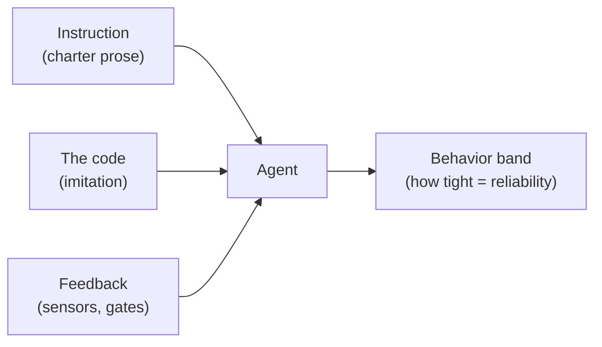

# How to Grow from Junior to Senior in the Age of AI

The agent changes what it means to be junior more than what it means to be senior. A senior
already has the judgment the tool can't supply. A junior is building that judgment at the exact
moment the tool offers to skip it — it hands you working code faster than you can understand it,
and the whole pull is to accept the diff and move on. This workshop is the structured refusal to
skip.

- **Who it's for:** early-career engineers working with an AI coding tool, and the leads who
  mentor them.
- **What you leave with:** the comprehension card (one rule, five questions, five moves) and a
  habit you can run on real work Monday morning.
- **The seam it drives home:** the agent produces plausible code fast; seniority is the judgment
  to tell plausible from correct. That judgment is trained, not downloaded.

> Work straight through **[The Lab](#the-lab)** — that's the 90-minute session.
> **[After the workshop](#after-the-workshop--the-take-home-lab)** is your take-home reps;
> **[Instructor notes](#instructor-notes)** are at the very bottom.

---

# The Lab

## Before you start — get to green

You can read code and you've used an AI coding tool once. That's enough. Run this first and
confirm a green suite — don't debug your environment on lab time:

```bash
git clone https://github.com/tacoda/workshop-junior-to-senior.git
cd workshop-junior-to-senior/seed
pip install pytest && pytest      # 3 passed — you're ready
```

⟲ **No local setup?** Pair with someone who's green, or run it in any browser Python sandbox —
the seed is two small files.

**For Step 4** you'll also use your AI coding tool (e.g. Claude Code) opened on the `seed/` folder —
have it installed and working before the session, not during it.

**What you'll work on.** The seed in [`seed/`](./seed/) is a tiny cash-register service: it settles
a bill for cash and prints a receipt. Pennies are discontinued, so cash totals round to a nickel —
and the decision that matters is **which way they round.** The charter's policy is *round down, in
the customer's favor*: they never pay more than the marked total. That single policy is what makes a
plausible-but-wrong change catchable.

## Your tool: the comprehension card

This is the whole method on one page. You'll use it in the lab and keep it next to your keyboard
after.

```text
THE DAILY RULE
  Don't merge a change you can't explain — to the agent, out loud, in your own words.
  Green pipeline = permission to proceed. Red = a lesson before a human had to teach it.

FIVE QUESTIONS (comprehension in — ask these of any diff)
  1. What does this do, in one sentence?
  2. Where does the change enter the system, and where does it leave?
  3. Why is it written this way? (If neither a rule nor a doc answers, you found a charter gap.)
  4. Is it consistent with the rest of the codebase? Which nearby code disagrees?
  5. Which part would I call slop if an agent wrote it — plausible, passing, quietly wrong?

FIVE MOVES (comprehension out — the junior→senior cases)
  1. Characterize before you change — pin current behavior in a test before you touch it.
  2. Rename in anger — fix the worst-named thing everywhere; watch it clarify.
  3. Make it boring — rewrite the clever version as the one you'd rather debug at 3 a.m.
  4. Predict the failure — write how you expect it to fail, then run it. Were you right?
  5. Catch the agent being wrong — find the confident, fluent, wrong answer. Prove it.
```

## Step 1 · Baseline, then spring the trap

Everything is in `seed/`. Copy-paste this block and read the comments as you go:

```bash
cd seed
pytest                                       # 3 passed
python app.py                                # cash total $10.80   ← rounded down, customer's favor

git apply patches/plausible-but-wrong.diff   # a diff "an agent handed you" — looks cleaner
pytest                                        # still 3 passed  ← the trap
python app.py                                 # cash total $10.85  ← a nickel overcharged
```

Look at those last two lines. The test suite is **green**, and yet the customer is now billed a
nickel more than the marked total. This is the one idea the whole session is built on:

> **Green means "the tests that exist passed," not "the code is correct."**

The shipped suite only used totals that round the same way either direction, so it never noticed the
flip. The diff rounds to the *nearest* nickel — the textbook cash-rounding scheme, written with a
`float` — instead of *down*, the charter's customer's-favor policy. Leave the diff applied; you'll
investigate it next.

## Step 2 · Run the five questions (comprehension *in*)

Open `seed/money.py` and read the change you just applied. With a partner if you can, work down the
five questions from the card, out loud. Write your answers down:

1. **What does it do, in one sentence?** (`round_cash` now rounds to the *nearest* nickel, not down.)
2. **Where does the change enter and leave?** Trace it from `app.py` into `money.py` and back to the
   printed cash total.
3. **Why is it written this way?** The comment says "simplified." Rounding to nearest *is* the
   textbook cash scheme — but is it *this business's* policy? And why is there suddenly a `float`?
4. **Is it consistent?** The docstring still promises cash rounds "in the customer's favor," and the
   charter's iron law says integer cents only. The code now breaks both. Which do you trust?
5. **What would you call slop?** Name the exact line that is plausible, passing, and quietly wrong.

A filled card is your first deliverable — and everyone reaches it.

## Step 3 · Prove it wrong (comprehension *out*)

Suspicion isn't a catch. Turn it into a test that fails:

- A $10.83 total is 1083¢. Customer's favor rounds **down** to `1080` ($10.80). The "simplified"
  code rounds to nearest: `1085` ($10.85) — a nickel the customer never owed.
- Write one test asserting cash never rounds *up*, using totals whose last digit forces the
  direction — the case the shipped suite skipped:

```python
def test_cash_never_rounds_up():
    for total in [1083, 1084, 999]:
        assert round_cash(total) == total - (total % 5)
```

Run `pytest`. It goes **red** on the diff — you just caught a confident, fluent, wrong answer and
proved it. That red test is the day you stop being junior, in miniature. Reset before the next step:

```bash
git apply -R patches/plausible-but-wrong.diff
```

## Step 4 · The two loops — a rule and a hook

You caught the overcharge by hand. Now let the *charter* catch it for you, with the two mechanisms
every charter is built from:

- **Feedforward** — a **rule** in `CLAUDE.md` that shapes the code *before* it's written.
- **Feedback** — a **hook** in `.claude/hooks/` that checks the result *after* and refuses a bad one.

Both are already on. Open the `seed/` folder in Claude Code and run two quick prompts.

1. **The rule steers (feedforward).** Ask your agent, verbatim:
   > Show me how you'd implement `round_cash(total_cents)` — round a cash total to a nickel now that
   > pennies are gone.

   With the rounding rule in `CLAUDE.md`, it rounds **down**, in the customer's favor
   (`total_cents - total_cents % 5`). Without that rule a capable agent rounds to the *nearest*
   nickel — the overcharge from Step 1. The rule is the difference.

2. **The hook catches (feedback).** Now ask it to write the bad version anyway:
   > Simplify `round_cash` to round to the nearest nickel: `round(total_cents / 5) * 5`.

   The moment it saves `money.py`, the hook fires and blocks it:
   ```text
   round-gate (edit): round_cash(1083) = 1085, but the customer's-favor amount is 1080 — cash rounded against the customer.
   ```
   Told *why*, the agent puts it back. The same gate also blocks at `git commit`, so a bad version
   can't be saved *or* shipped.

**One rule, one hook:** the rule shaped the draft, the hook caught the one that slipped. That's the
whole toolkit a charter uses to bound what an agent does.

## How it works — the two knobs

You just used one setting of each loop. Both have a design choice, and the seed ships two examples
of each so you can feel the tradeoff, not just read it.

**Feedforward — the rule's *specificity* (`seed/.claude/rules/`).** A rule you cannot fail is a
rule that cannot steer.

| Rule | What it says | Tradeoff |
|---|---|---|
| `cash-vague.md` | "Round cash fairly to a nickel." | Cheap, universal, ages well — and exerts almost no force. Nearest-nickel reads as compliant. |
| `cash-concrete.md` | "Round *down* to the nickel; 1083¢ settles at 1080, not 1085; integer math." | More work, narrower scope — but it decides a contested choice the agent would otherwise make for you. |

**Feedback — the gate's *position* (`seed/.claude/hooks/`).** Same check, different distance from
the mistake. The earlier the loop closes, the cheaper the fix.

| Hook | Event | Speed / consequence |
|---|---|---|
| `round-gate-edit.py` | `PostToolUse` on `Edit`/`Write` | **Fast.** Fires the instant `money.py` is saved; agent corrected mid-task, fix is local. The bad code did exist on disk for a moment. |
| `round-gate-commit.py` | `PreToolUse` on `git commit` | **Late.** Fires only at ship time; nothing bad ever lands, but the mistake may be buried under later work, so the fix costs more. |

**When to reach for which loop.** The two loops aren't interchangeable:

- **Feedforward (rules)** — for *contested decisions the model won't guess right*. Rounding
  direction is one: left alone, a capable agent rounds to nearest (with a float) every time. The
  rule is what makes it round your way.
- **Feedback (hooks)** — for *invariants the model must never violate*, whether or not it usually
  gets them right. A hook is a guarantee; a rule is only a nudge.

**Try the variants (optional).** Each swap is one step; undo it when done.

- *Weak rule:* replace the rounding line in `CLAUDE.md` with the line from `.claude/rules/cash-vague.md`,
  restart the agent, and re-run Step 4 prompt 1 — watch the vague rule fail to steer.
- *Commit gate alone:* delete the `PostToolUse` block from `.claude/settings.json` so only the late
  gate is wired, then re-run Step 4 prompt 2 — the bad edit now sails through and is caught only at
  commit. That gap between "caught on save" and "caught at ship" is the cost of a slow loop.

A rule without a hook is a suggestion; a hook without a rule is a gate no one explained. Together —
guidance you write, enforcement you run — they're the smallest whole unit of a charter, and the two
mechanisms to reach for first.

## Think it through — the policy just changed

> **Discussion.** The company changes its mind: cash should now always round **up** — the
> merchant's favor, never the customer's. You want the agent to write round-*up* code from now on.
> **What has to change?** Talk it out before you read the answer.

The tempting answer is "edit the rule." That is necessary but *not sufficient* — and the gap is the
whole lesson. Three things describe the rounding policy, and all three have to move together:

1. **The rule (feedforward)** — `CLAUDE.md` and `.claude/rules/cash-concrete.md`. Change "round
   down, customer's favor" to "round up, merchant's favor":
   > Rounding policy: cash totals round **UP** to the next nickel (5 cents), in the merchant's favor.
   > Never round down, and never round to the nearest nickel.

2. **The code (imitation)** — `seed/money.py`. This is the one people forget, and it's the one that
   matters most. Change the implementation *and* its docstring:
   ```python
   def round_cash(total_cents):
       """Round a cash total UP to the next nickel (5 cents), in the merchant's favor."""
       return -(-total_cents // 5) * 5    # integer ceil to a nickel
   ```

3. **The hook (feedback)** — both files in `.claude/hooks/`. Flip the check from floor to ceil so it
   now blocks anything that *doesn't* round up:
   ```python
   want = -(-total // 5) * 5      # was: total - (total % 5)
   if got != want:               # block when the code failed to round up
   ```

**Why you still have to change the code — and why the lab can't show it.** At the size of this seed
the rule is right in front of the agent and the contradiction is glaring, so a capable agent follows
the rule and even flags the stale code as wrong. (We tested exactly this contradiction on fresh
agents — rule says up, code says down — and they rounded up every time, one of them explicitly
calling out the old code as non-compliant.) **The imitation problem is a scale effect.** In a real
codebase — thousands of lines, the rule one entry in a long charter, round-down rounding repeated
across dozens of call sites — the *prevailing pattern in the code* becomes the strongest signal the
agent has, and it copies that pattern past a rule it barely weighs. The lab is too small to reproduce
this; the takeaway is what it points at.

**And it bites hardest at the architecture level.** Rounding direction is a simple, local decision the
model can derive from the rule alone — which is exactly why the lab agents got it right. The rules
imitation actually defeats are the *design-level* ones, where most of a charter's rules live: "use
ports and adapters," "no business logic in controllers," "depend on interfaces, not concretes." There
is no one-line correct answer to copy; the agent infers "how we do it here" from the surrounding code.
If most of the codebase ignores the rule, the counterexamples *are* the pattern, and the agent
replicates them — the more non-compliant code, the stronger the pull. The cost of a rule the code
contradicts isn't a wrong penny; it's an architecture that drifts further from its own charter with
every change.

So changing the code isn't optional:

- **The old code is a real defect.** A rule is a promise about *future* code; it doesn't retroactively
  fix `round_cash`, which keeps rounding down in production until someone edits it.
- **At scale, the code is what the agent imitates.** Leave a round-down implementation in the tree and
  you've planted the pattern the next change copies — the more of it there is, the louder it gets.

The **hook removes the gamble** — it blocks any round-down result regardless of what the agent
weighed, in the lab and at scale alike. But the hook is a backstop. The durable fix is to **make the
code correct**: when nothing in the tree rounds down, there is no contradictory pattern to imitate and
no defect left in production. Feedforward, feedback, *and* the code itself have to agree.

## The bigger picture — three surfaces, spent sparingly

Step back from the pennies. Everything in this session is about the surfaces that bound what an agent
does. There are three, and you just met all of them:



- **Instruction** — the charter prose the agent reads: rules, `CLAUDE.md`. This is feedforward.
- **The code** — what already exists in the repo, which the agent imitates. The surface juniors
  forget, and the one that dominates at scale.
- **Feedback** — the sensors and gates that check the result: tests, hooks. This is feedback.

Each surface narrows the **behavior band** — the range of things the agent might do. Reliability is
just a tight band. Add a surface and the band gets narrower.

Here's the honest part: **this lab is a toy.** A two-line `round_cash` does not deserve a rule and
two hooks — in real life you'd read it once and move on; you would never gate something this small.
Every rule and hook costs effort to write and, worse, to keep true as the code changes. So the goal
is never *the most* constraints. It's **the fewest constraints that buy a tight-enough band** — you
add one only when something real needs it: money, security, data integrity, a policy with legal or
financial weight.

Where does that pay for itself? Not here — in a production app. Many files, many tests, many policies
and requirements, many contributors, an agent making changes all day. There the code surface is huge,
no human reads every diff, and comprehension alone can't scale. A few well-placed rules and hooks on
the things that actually carry risk keep the band tight when nothing else can. That is when the two
mechanisms you practiced today earn their cost — and knowing *when not* to reach for them is as much
the senior's job as knowing how.

## What you leave with

- The comprehension card — the daily rule, the five questions, the five moves.
- A filled card applied to a real agent diff.
- A test you wrote that catches the planted overcharge.
- A working mental model: three surfaces bound an agent — the rule you write (instruction), the code
  it imitates, and the hook that checks it (feedback) — and reliability is just a tight behavior band.

---

# After the workshop — the take-home lab

The session gives you the card and one rep on a toy repo. Judgment comes from reps on real code you
didn't write. This lab is yours to run afterward — no instructor, no answer key. Do it on a project
you'll never ship to, so you can be wrong for free.

**Why an open-source project.** A toy seed can't teach you scale, history, or the weight of code
other people depend on. A real project can: it's readable at your own pace, its commit history
records why every line is the way it is, and its test suite shows what "proven correct" actually
looks like. The five questions and five moves are the same; only the code got real.

**Why SQLite is the one to start on.**
- **Small enough to hold.** One file's worth of public API, navigable in an afternoon.
- **Famous for its tests.** It ships far more test code than library code, and documents *how* it's
  tested — the discipline this workshop trains, at professional scale.
  ([sqlite.org/testing.html](https://www.sqlite.org/testing.html))
- **The docs explain the *why*** — which is question 3 on your card, answered for you.
- **Self-contained C.** Legible and dependency-free; you see exactly where a change enters and
  leaves.

Source and docs: [sqlite.org](https://www.sqlite.org/) · source at
[sqlite.org/src](https://www.sqlite.org/src/) · a readable mirror lives on GitHub.

**Run the card on real code:**
1. **Read one design doc, explain it back.** Pick a page from the SQLite docs, read it, then explain
   it to your agent in your own words. Where you stall is where you didn't understand.
2. **Comprehension pass.** Choose one self-contained function. Run all five questions against it.
   Use the agent as a tutor — ask *what*, *where*, *why* — but form your own answer first.
3. **Predict the failure (move 4).** Pick one test. Before reading it, predict what input would
   break the code it guards. Then read the test. Were you right?
4. **Catch the agent wrong (move 5).** Ask your agent to "simplify" or "optimize" one small
   function. Run the five questions on its diff. Prove it correct, or prove it wrong with a test.
5. **Legibility read (move 3).** Find the best-named and worst-named thing you can. Ask why the good
   one is good. That instinct is what you're building.

**Repeat step 4 weekly** on any codebase you touch. The habit is the deliverable, not any one catch.

---

# Instructor notes

*Everything below is for whoever runs the session. Attendees don't need it.*

## Running the session

| Length | Shape | Deliverable |
|---|---|---|
| **90 min** | Talk + one live lab + discussion | The comprehension card, applied once to a real agent diff |

The whole lab runs live in 90 minutes — talk, Steps 1–4, the two knobs, and the "policy just changed"
discussion, which is where the senior-level insight lands. This works only if everyone's `pytest`
**and** Claude Code are green *before* the session; pre-flight is non-negotiable.

**Agenda:**

| Clock | Min | Segment |
|---|---|---|
| 0:00 | 5 | Welcome; confirm everyone is green (pre-flight done ahead of time) |
| 0:05 | 15 | Talk — the frame, the key ideas, the "a diff I couldn't explain" anecdote |
| 0:20 | 3 | Step 1 — baseline & spring the trap |
| 0:23 | 14 | Step 2 — the five questions, in pairs |
| 0:37 | 12 | Step 3 — prove it wrong (write the failing test) |
| 0:49 | 12 | Step 4 — the rule + the hook (two prompts) |
| 1:01 | 10 | How it works — the two knobs (walk the tradeoffs; try one variant) |
| 1:11 | 12 | Think it through — "the policy just changed" (pairs, then share) |
| 1:23 | 7 | The bigger picture + wrap (what you leave with) |

Tight on time? The safe cuts, in order: the two knobs → the bigger picture → shrink the talk. Never
cut Steps 1–4 or the wrap — they're the rep and the payoff. Anything cut becomes take-home.

- **Cut talk before you cut lab.** If you run long, shrink the talk; never the lab.
- **Pre-flight matters.** Put the *Before you start* block in the calendar invite and on the opening
  slide. A failed `pip install` — or a missing Claude Code — in minute two costs someone the lab.
  Step 4 needs Claude Code working on the seed for everyone; confirm it ahead, not in the room.
  Anyone red at the start pairs with someone green.
- **Protect the "I almost shipped that" moment.** Step 1's trap and Step 3's red test are the
  emotional core. Don't spoil that green ≠ correct — let the room discover it.
- **Regroup on the catch.** Who spotted the overcharge? Surface the near-miss out loud; it's the
  point of the whole session.

## The talk — the frame and the spine

Open with the split that organizes everything around the agent: **does it execute, or is it read?**
The machinery executes (the agent, the loop, the tools); the charter is read (the `CLAUDE.md`, the
rules, the gates). Comprehension is the attendee's job because the agent can produce the code but not
the judgment that it's right. — *ch04–06, Appendix E.*

Keep it a talk, not a lecture: ask the room for a time they merged a diff they couldn't explain, and
what it cost. That story is the whole workshop in one anecdote.

**Key ideas to land** (from Appendix E — say these out loud; they're the spine):

> - The agent changes what it means to be *junior* more than what it means to be *senior*. A senior
>   already has the judgment the tool can't supply; a junior is building it at the exact moment the
>   tool offers to skip it.
> - A senior is not the engineer who types less. A senior is the engineer who understands enough to
>   know when the agent is wrong — and you only get there by asking.
> - Make comprehension the requirement, not the option. Use the agent to *explain*, never to *skip*.
> - A green pipeline is permission to proceed. A red one is the system teaching you something before
>   a human had to.
> - The arrangement is two-sided: **you bring comprehension; the team keeps the charter good enough
>   to onboard you and the harness good enough to guard you.** A junior's confusion is usually the
>   charter's missing onboarding, not a gap in the junior.
> - The day you can reliably catch a confident, fluent, wrong answer is the day you are no longer
>   junior.

## Why cash rounding, and why feedforward is the hard half to demo

This seed's case was chosen from a real experiment, and the result shapes how you should teach it:

- **Conservation doesn't steer.** An earlier seed used a money-conservation invariant (shares must
  sum to the total). Across many fresh-agent trials, the agent conserved money **every time, with or
  without the rule** — a capable model distributes remainder cents by default. A conservation *rule*
  is invisible; only a *hook* proves anything. Good feedback demo, useless feedforward demo.
- **Rounding direction does steer.** Asked to round a cash total to a nickel, fresh agents rounded to
  the **nearest** nickel (with a `float`) unanimously with no rule; add "round down, customer's
  favor" and they switched to an **integer round-down** unanimously. The two differ on ~40% of
  totals. That is a rule visibly changing behavior — and it happens to fix the float too.

The lesson to land in Step 4: **use feedforward for contested choices the model won't guess right,
and feedback for invariants it must never violate.** If a live prompt-1 ever shows the agent already
rounding down without the rule, that's the teaching moment, not a failure — say so and move to the
hook.

## Mixed room

Pair a stronger engineer with a newer one for the lab. Let the stretch in Step 3 and the variants in
*How it works* absorb fast finishers so you never pace to the ceiling.

## References

- **The seed's design** is documented in [`seed/README.md`](./seed/README.md): why the shipped suite
  is deliberately incomplete, what each file does, and the full flow.
- `seed/patches/plausible-but-wrong.diff` — the plant (nearest nickel, via float).
- `seed/patches/gate-test.diff` — the rounding gate as a test, for reference.
- **Book map.** Appendix E ("For the Junior Engineer") is the spine. Foundations ch01–07 (the split,
  the reliability problem, the repo as a behavioral system); ch14 (the legible codebase); ch15 (tests
  and gates).

## To refine (working notes)

- [ ] Time-box each lab step against a real run; adjust the pacing table.
- [ ] Decide whether to demo the *variants* live or leave them as take-home.
- [ ] Step 4 demos the *edit* gate live; the commit gate is only mentioned. To show it firing, apply
      the plant in the shell and ask the agent to commit (both hooks are on, so the edit gate would
      otherwise catch it first).
- [ ] Step 4 prompt 1 *states* the no-rule behavior (rounds to nearest) rather than toggling it live,
      to keep the pace up. To demo the toggle live, comment the rounding rule out of `CLAUDE.md` and
      restart the session so it reloads — budget a few extra minutes.
